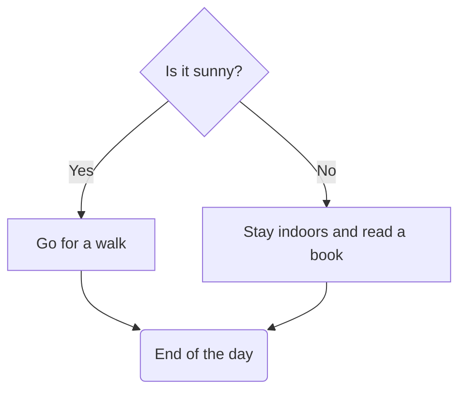

[Azure AI Community GitHub](https://github.com/Azure-AI-Community)

# AzureAI Community Semantic Kernel Plugin - Mermaid Plugin

The `AzureAI.Community.SK.Plugin.MermaidPlugin` is a plugin designed to generate and work with Mermaid diagrams. 
This plugin provides a function `GenerateMermaid` to facilitate diagram generation directly within the Azure AI Semantic Kernel.

## Overview

Mermaid is a simple and powerful syntax for generating diagrams. The `MermaidPlugin` integrates this functionality with the Microsoft Semantic Kernel, allowing users to generate diagrams by leveraging this plugin's capabilities.

## Prerequisites

To use the `MermaidPlugin`, you must have the following in place:

- Azure AI Semantic Kernel installed.
- Access to the Semantic Kernel Plugin system.

## Installing the Plugin

To install the `MermaidPlugin`, simply add it to your project through the kernel.

### Example Code:

```csharp
// Add the MermaidPlugin to the Kernel
kernel.Plugins.AddFromType<MermaidPlugin>(nameof(MermaidPlugin));

```

## Example Usage

string diagramDescription = @"
The decision starts with a question: Is it sunny? If the answer is yes, you choose to go for a walk and enjoy it.
If the answer is no, you decide to stay indoors and read a book. Both activities lead to the same conclusion: the end of the day. 
";

## Generate a Mermaid diagram from the description

